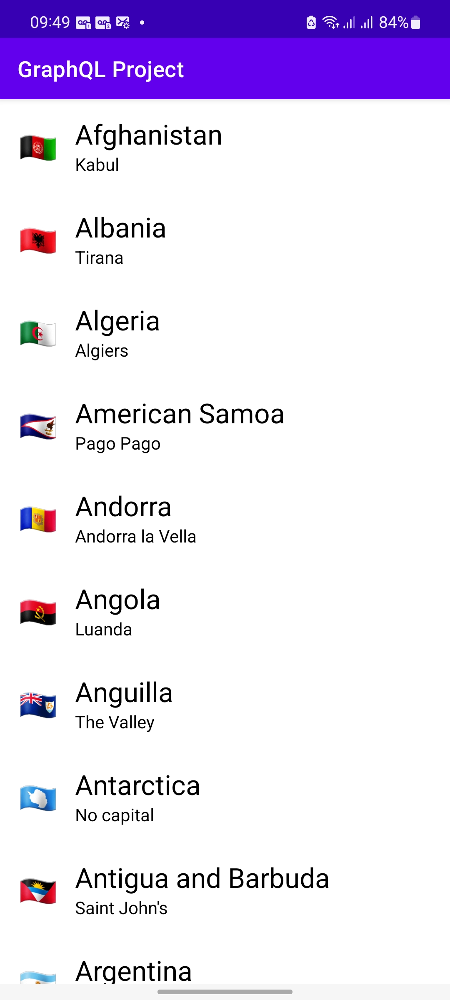
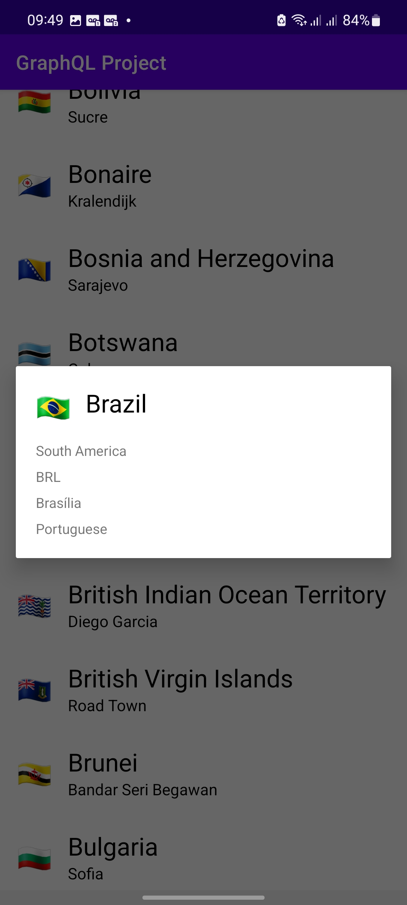

<h1 align="center">GraphQL Project</h1>

  
   
  
  
  

  

⭐ Esse é um projeto para demonstrar meu conhecimento técnico no desenvolvimento Android nativo com Kotlin utilizando GraphQL para consultar dados selecionados da API.

O aplicativo exibe uma lista de países e é possível clicar sobre para obter informações detalhadas. 

 

## Tecnologias usadas

- Minimum SDK level 21
- [Linguagem Kotlin](https://kotlinlang.org/)

- Jetpack
  - Lifecycle: Observe os ciclos de vida do Android e manipule os estados da interface do usuário após as alterações do ciclo de vida.
  - ViewModel: Gerencia o detentor de dados relacionados à interface do usuário e o ciclo de vida. Permite que os dados sobrevivam a alterações de configuração, como   rotações de tela.
  - ViewBinding: Liga os componentes do XML no Kotlin através de uma classe que garante segurança de tipo e outras vantagens.

- Arquitetura
  - MVVM (View - ViewModel - Model) com Clean Architecture
  - Comunicação da ViewModel com a View através de LiveData
  - Comunicação da ViewModel com a Model através de UseCases
  - Repositories para abstração da comunicação com a camada de dados.
  - Injeção de dependência com Hilt.

## Arquitetura
**GraphQL Project** utiliza a arquitetura MVVM com Clean Architecture, que segue as [recomendações oficiais do Google](https://developer.android.com/topic/architecture).
  

## Créditos pelo conteúdo
- [Philipp Lackner](https://www.youtube.com/watch?v=ME3LH2bib3g)

